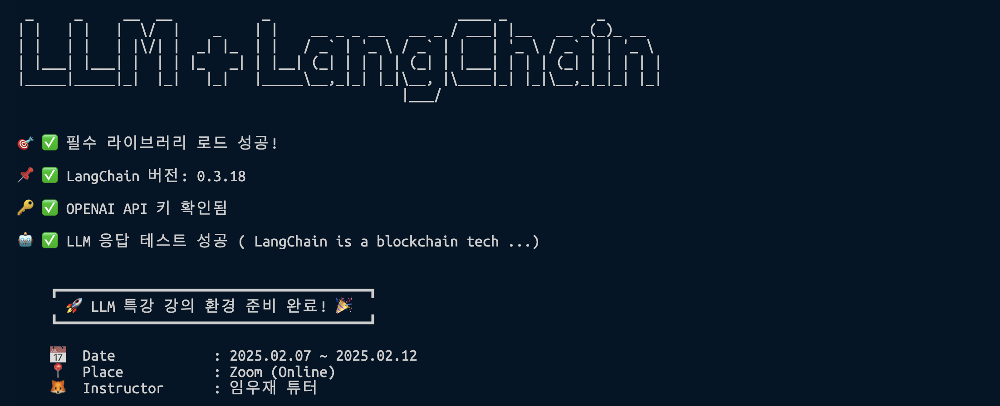

# LLM 특강 강의 자료(feat. LangChain)

- Date : 2025.02.07 ~ 2025.02.12
- Place : Zoom(Online)
- Instructor : 임우재 튜터

---

## How to use

```bash
# Virtual Environment
python -m venv lang-venv

# macOS
source lang-venv/bin/activate

# Windows
lang-venv\Scripts\activate

# Install Requirements
pip install -r requirements.txt

# Set .env
touch .env
echo "OPENAI_API_KEY=your_openai_api_key" > .env
# or
OPENAI_API_KEY=your_openai_api_key # to .env file
```

```
# Environment Check
python 000_test.py
```



